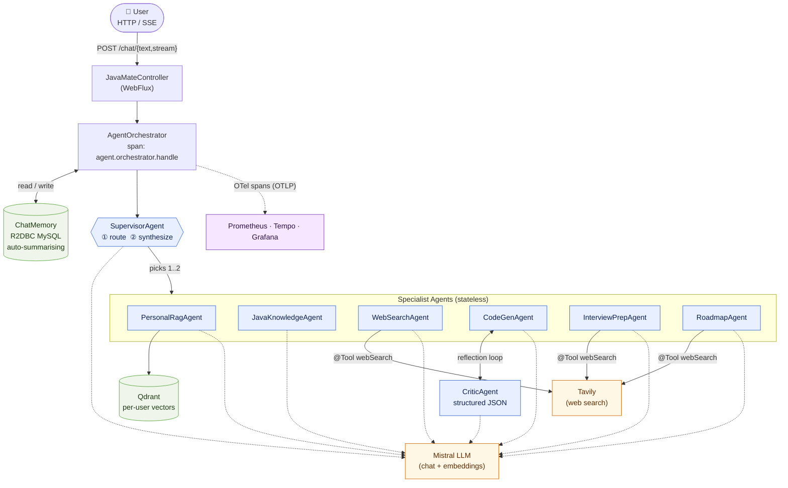
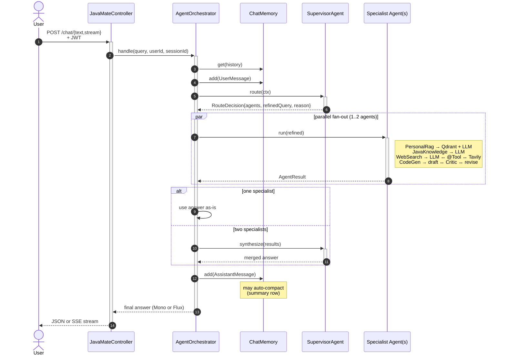
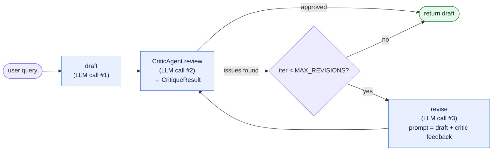
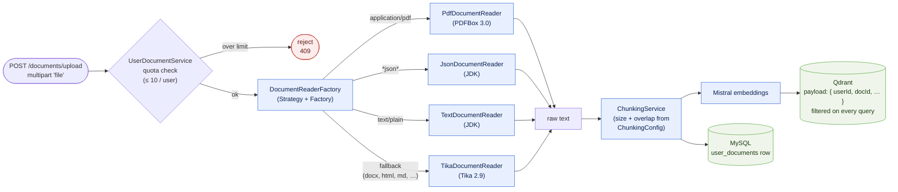
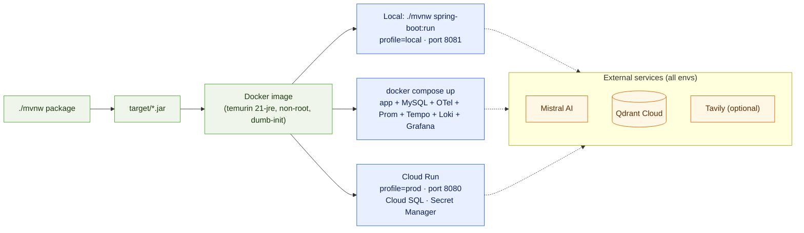

<div align="center">

# ☕ JavaMate

**A multi-agent Java coding assistant. Built on Spring AI 2 and Spring WebFlux.**

[]()
[]()
[]()
[]()
[]()
[]()
[]()
[]()

</div>

---

## Why I built this

The Java ecosystem is huge. Between core JVM concepts, Spring Boot, Spring Data, Spring Security, Spring AI, reactive stacks, build tools and the long tail of libraries, a beginner or fresher can spend months just figuring out *what to learn next*. General-purpose assistants help, but they treat Java like one topic among hundreds, and the answers reflect that.

JavaMate is built specifically for **beginner and fresher Java developers** who want a focused mentor instead of a generalist chatbot. The design is shaped by three goals:

- **Specialised, not generic.** Every agent has a tight role — a Java/Spring mentor, a personal-knowledge agent over the learner's own notes, a web search agent for fresh ecosystem news, and a code generator with a built-in critic. A Supervisor agent picks the right one (or two, in parallel) per query instead of cramming everything into one prompt.
- **Grounded in *your* material.** Beginners accumulate notes, course PDFs, project READMEs and bookmarks. JavaMate ingests them into a per-user vector store so answers can cite *your* learning material, not generic blog posts.
- **Debuggable.** Every LLM call and tool call is its own OpenTelemetry span. When an answer is off, you can open the Tempo trace and see exactly which agent decided what, instead of staring at a black box.

The longer version is in the code.

---


## Architecture at a glance



> Specialists are stateless. The orchestrator owns chat memory. Adding a new agent is just one `@Component implements Agent`, no changes to the pipeline.

---

## Features

### Multi-agent
- Supervisor pattern with typed structured-output routing (a Java record, not regex over LLM JSON).
- 6 specialist agents + 1 critic, each with its own system prompt and temperature (PersonalRag, JavaKnowledge, WebSearch, CodeGen, InterviewPrep, Roadmap).
- Reflection loop for code generation. The Critic returns `CritiqueResult{approved, issues[], suggestions}` and the drafter revises (max 1 revision, configurable).
- Parallel fan-out when two specialists are needed (`Flux.merge`), then a synthesizer LLM call to merge their answers.

### RAG & document ingestion
- Per-user vector isolation in Qdrant. Every similarity search is filtered by `userId`.
- Ingestion pipeline supports PDF (PDFBox), Apache Tika, plain text and JSON.
- Configurable top-K, chunking and per-user document quota.

### Tool calling
- Web search is a plain Java method annotated with `@Tool`. Spring AI handles the LLM ↔ tool loop on its own.
- Provider is pluggable behind `WebSearchClient` (Tavily by default, NoOp fallback if no API key is set so the app still boots).

### Memory
- Chat memory is R2DBC reactive, backed by MySQL.
- Auto-compaction: when a session passes a threshold, the oldest messages are summarised by the LLM and stored as a `SUMMARY` row, so the context window stays bounded forever.
- Multi-session per user, listable and clearable via REST.

### API
- `POST /mate/chat/text` for full responses, `POST /mate/chat/stream` for SSE token streams.
- JWT auth (jjwt 0.12.x) via a reactive `WebFilter`.
- Document upload, chat-session CRUD, health / actuator, Swagger UI.

### Observability
- Every agent, every tool call and every reflection iteration is its own OpenTelemetry span.
- Prometheus metrics + JVM / HTTP / pool metrics.
- OTLP exporter -> `otel-collector` -> Tempo -> Grafana (datasources auto-provisioned).

### Engineering
- Fully reactive (Spring WebFlux + R2DBC). Blocking SDK calls run on `Schedulers.boundedElastic()`.
- Clean package layout: `agent`, `service`, `controller`, `repository`, `security`, `config`.
- Test profile with dummy creds so the Spring context loads in CI.
- Dockerised with `docker-compose` bundling the app, Prometheus, Tempo, OTel collector and Grafana.

---

## Tech stack

| Layer | Tech | Why |
|---|---|---|
| Runtime | Java 21 | Records, pattern-matching switch, sealed types |
| Framework | Spring Boot 4, Spring AI 2.0 (M2), Spring WebFlux, Spring Security | Spring AI gave me `@Tool`, structured output and `ChatMemory` for free |
| LLM | Mistral AI (chat + embeddings) | Cheap, good function-calling, hosted |
| Vector DB | Qdrant (gRPC) | Per-user filter is native, no extra schema work |
| Relational DB | MySQL via R2DBC | The rest of the stack is reactive, I didn't want a blocking JDBC pool starving under SSE load |
| Auth | JWT (jjwt 0.12.x) | Stateless, easy to verify in a reactive `WebFilter` |
| Ingestion | Apache Tika 2.9, PDFBox 3.0 | Handles most file types I throw at it |
| Observability | OpenTelemetry, Micrometer Tracing, Prometheus, Grafana Tempo | Tempo waterfalls were the only way to debug multi-agent latency |
| Docs | springdoc-openapi / Swagger UI | Generated from the controllers |
| Build / Packaging | Maven, Lombok, Docker, docker-compose | Standard stack |

---

## Request flow (one chat turn)



Every step emits an OpenTelemetry span (`agent.orchestrator.handle` -> `agent.supervisor.route` -> `agent.<name>` -> `tool.web_search` / `agent.critic` / etc.), so the whole turn shows up as a waterfall in Tempo.

## CodeGenAgent: the reflection loop



Default is one revision max, so a code question costs 2–3 LLM calls. Tune `MAX_REVISIONS` in `CodeGenAgent` for stricter or cheaper behaviour.

---

## Project layout

```
src/main/java/com/example/javamate/
├── agent/                          ← multi-agent layer
│   ├── Agent.java   AgentContext.java   AgentName.java   AgentResult.java
│   ├── SupervisorAgent.java         router + synthesizer
│   ├── PersonalRagAgent.java        Qdrant-backed RAG
│   ├── JavaKnowledgeAgent.java      pure LLM
│   ├── WebSearchAgent.java          LLM + @Tool
│   ├── CodeGenAgent.java            reflection loop
│   ├── InterviewPrepAgent.java      fresher-focused Q&A, LLM + @Tool webSearch (+ fallback)
│   ├── RoadmapAgent.java            learning roadmaps, LLM + @Tool webSearch (+ fallback)
│   ├── critic/{CriticAgent, CritiqueResult}.java
│   ├── router/RouteDecision.java
│   ├── prompts/AgentPrompts.java
│   ├── tools/{WebSearchClient, Tavily…, NoOp…, WebSearchTools}.java
│   ├── tracing/AgentTracing.java
│   └── orchestrator/AgentOrchestrator.java
├── service/  controller/  config/  security/
├── dto/  entity/  repository/
├── factory/  readerHandler/         document ingestion (PDF, Tika, Text, JSON)
└── utils/  exception/  constants/
```

---

## API endpoints (excerpt)

| Method | Path | Purpose |
|---|---|---|
| `POST` | `/mate/auth/register` | Register (email) → returns JWT |
| `POST` | `/mate/auth/login` | Login (email) → returns JWT |
| `POST` | `/mate/auth/google` | Exchange Google OAuth2 **ID token** for a JWT |
| `POST` | `/mate/chat/text` | Non-streaming chat |
| `POST` | `/mate/chat/stream` | SSE token stream (typed `AgentStreamEvent`s) |
| `GET` / `POST` / `DELETE` | `/mate/chat/sessions/**` | List / create / continue / delete chat sessions |
| `POST` | `/mate/documents/upload` | RAG ingestion (PDF / Tika / text / JSON) — `multipart/form-data`, field `file` |
| `GET` | `/mate/documents`, `/mate/documents/{id}` | List user's RAG documents or fetch one |
| `DELETE` | `/mate/documents/{id}` | Delete a RAG document |
| `GET` | `/mate/health`, `/mate/actuator/**` | Liveness (used by Cloud Run / Docker), metrics, Prometheus |
| `GET` | `/mate/swagger-ui.html` | Live OpenAPI docs |

> When a session hits `SESSION_LIMIT_EXCEEDED` (see Limits below), call `POST /mate/chat/sessions/new` to mint a fresh session id.

---

## Limits & quotas

Defaults baked into `application.properties` and the agent code. All are overridable per environment.

| Limit | Default                          | Where | Behaviour when exceeded |
|---|----------------------------------|---|---|
| Documents per user (RAG) | **10**                           | `javamate.knowledge-base.max-documents-per-user` | Upload rejected — delete one via `DELETE /mate/documents/{id}` |
| User messages per session | **30**                           | `javamate.chat.memory.max-messages-per-session` | Response returns `SESSION_LIMIT_EXCEEDED` — call `POST /mate/chat/sessions/new` (or `/continue`) |
| Upload size cap | **100 MB**                       | `spring.webflux.multipart.max-file-size` | `413 Payload Too Large` |
| Context window (recent msgs in prompt) | **20**                           | `javamate.chat.memory.window-size` | Older turns are compacted, not dropped |
| Auto-compaction threshold | **5** stale msgs past the window | `javamate.chat.memory.compact-threshold` | Oldest messages summarised by LLM and stored as a `SUMMARY` row |
| Critic revisions per code-gen turn | **1**                            | `MAX_REVISIONS` in `CodeGenAgent` | Returns the latest draft as-is |

---

## Document ingestion

`POST /mate/documents/upload` accepts a single multipart `file`. The content type is sniffed and routed by `DocumentReaderFactory` to the right `DocumentReader` implementation (Strategy + Factory pattern — adding a new format is a one-class change).

Extracted text is chunked (`ChunkingService` + `ChunkingConfig`), embedded via Mistral, and stored in Qdrant with a `userId` payload so every retrieval is automatically tenant-scoped.



---


## Deployment

One build artifact, three runtime targets. The only thing that changes between them is the active Spring profile and a handful of env vars — the JAR and the Docker image are identical.

**The image.** A multi-stage-friendly `Dockerfile` on top of `eclipse-temurin:21-jre-jammy`. It creates a non-root `javamate` user, copies the fat JAR built by Maven, runs under `dumb-init` for clean PID-1 signal handling, applies container-aware JVM flags (`-XX:+UseContainerSupport`, `MaxRAMPercentage=75`), and ships a `HEALTHCHECK` that hits `/mate/actuator/health`. It listens on `$PORT` (defaults to `8080`) so it drops into Cloud Run with zero config.

**The flow.**



1. **Build once.** `./mvnw -DskipTests package` produces `target/javamate-*.jar`. `docker build .` bakes that JAR into the runtime image.
2. **Local dev** runs the JAR directly with `./mvnw spring-boot:run` on the `local` profile (port `8081`). It still talks to **Qdrant Cloud** and **Cloud SQL** over the network, so you get production-shaped behaviour without the observability stack overhead.
3. **Local stack** (`docker compose up -d`) starts the app plus the full sidecar set: **MySQL 8** (instead of Cloud SQL), **OTel Collector**, **Prometheus**, **Tempo**, **Loki** and a pre-provisioned **Grafana** (admin/admin on `:3000`). The app pushes OTLP traces/metrics to `otel-collector:4317`, which fans them out to Tempo + Loki; Grafana datasources are auto-wired from `observability/grafana/provisioning/`. Use this when you want to actually watch a chat turn become a Tempo waterfall.
4. **Cloud Run** runs the same image with `SPRING_PROFILES_ACTIVE=prod`, listens on `$PORT=8080`, mounts `JWT_SECRET` / `MISTRAL_API_KEY` / `QDRANT_API_KEY` / `MYSQL_PASSWORD` from **Secret Manager**, and talks to **Cloud SQL (MySQL)** over its public IP with `sslMode=PREFERRED`. The prod profile flips logs to JSON for Cloud Logging, drops trace sampling to **10 %**, shrinks the DB pool, and enables **HTTP/2 cleartext (h2c)** via `NettyH2cConfig` — that last bit is why the 100 MB upload cap actually works behind Cloud Run's HTTP/1 body size limit.

External dependencies (**Mistral**, **Qdrant Cloud**, **Tavily**) are the same across all three targets; only the credentials change.


| Target | Command | Profile | Notes |
|---|---|---|---|
| Local dev | `./mvnw spring-boot:run` | `local` | Hits Qdrant Cloud + Cloud SQL directly |
| Local stack | `docker compose up -d` | `local` | Adds MySQL + full observability stack |
| Cloud Run | `gcloud run deploy` with `SPRING_PROFILES_ACTIVE=prod` | `prod` | JSON logs, smaller pool, sampling 10 %, secrets from Secret Manager |

**Required env vars:** `MISTRAL_API_KEY`, `QDRANT_API_KEY`, `MYSQL_PASSWORD`, `JWT_SECRET`. Prod also needs `CLOUD_SQL_HOST`. Optional: `GOOGLE_OAUTH_CLIENT_IDS` for Google sign-in and `WEB_SEARCH_PROVIDER=tavily` + `TAVILY_API_KEY` to enable web search.

---

## Companion frontend & demo

JavaMate ships as a **backend-only Spring service**. The chat UI lives in a separate repo:

- **Frontend repo:** [`java-mate-fe`](https://github.com/sanjaygupta45/javaMate-fe) (React + Tailwind CSS)
- **Live demo:** <https://java-mate-fe.vercel.app>
- **Live API:** Cloud Run deployment, talked to by the frontend above
- **Swagger UI (prod):** `https://javamate-895510939347.us-central1.run.app/mate/swagger-ui.html`

---

## Things I learned doing this

### Spring AI
- An "agent" is just an LLM in a loop with tools, and multi-agent is just several of those loops behind a router — Spring AI's `ChatClient` fluent API hides 90% of what you'd otherwise hand-roll.
- Structured output (`.entity(SomeRecord.class)`) and `@Tool`-annotated methods are the two biggest reliability wins: typed records instead of hand-parsed JSON, and a plain Java method becomes a callable function for the LLM.

### RAG
- Chunking is the whole game — bad chunk size/overlap silently destroys retrieval quality long before the LLM is the bottleneck, and I tuned chunking far more often than I tuned prompts.
- Per-user vector isolation has to be a *filter at query time*, not a convention; Qdrant's native payload filter on `userId` turned multi-tenant RAG into a one-liner.

### Memory management
- Naive "append every turn" memory blows up the context window fast, so auto-summarising old turns into a single `SUMMARY` row keeps the context bounded forever for one extra LLM call per compaction.
- Backing `ChatMemory` with R2DBC instead of an in-memory map (and scoping every read/write by `userId` + `sessionId`) was the difference between "works on my machine" and "survives a pod restart".

### Streaming responses
- Streaming over SSE with `Flux<String>` end-to-end (LLM → orchestrator → controller → browser) makes the app *feel* an order of magnitude faster, even though total latency is unchanged.
- The hard part is keeping the whole pipeline reactive — one `.block()` or blocking JDBC call stalls the stream, so blocking SDKs (PDF, vector ops) must be pushed onto `Schedulers.boundedElastic()`.

### Observability
- Per-agent OpenTelemetry spans are not optional past two LLM calls per request — the first Tempo waterfall I opened exposed a redundant retrieval pass I didn't even know was running.
- Tagging spans with `agent.name`, `tool.name`, `tokens.in/out` and `model`, plus trace↔log correlation in Grafana (Prometheus + Tempo + Loki), turns the trace view into a free debugger *and* a cost dashboard.

---

<div align="center">

**Built with Java 21, Spring AI, Reactor and a lot of caffeine.** ☕

</div>
