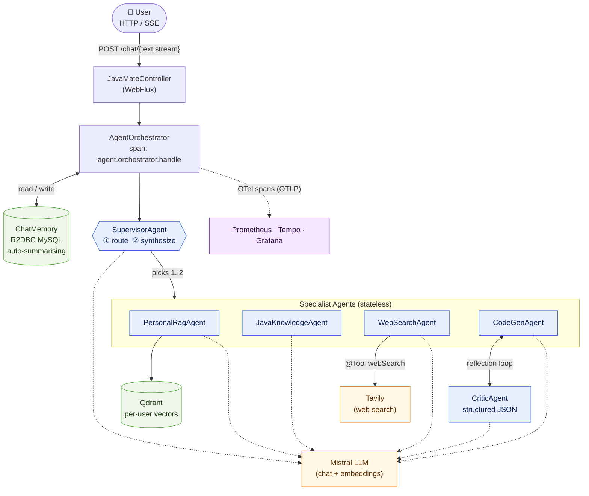

<div align="center">

# ☕ JavaMate

**A multi-agent Java coding assistant. Built on Spring AI 2 and Spring WebFlux.**

[]()
[]()
[]()
[]()
[]()
[]()
[]()
[]()

</div>

---

## Why I built this

The Java ecosystem is huge. Between core JVM concepts, Spring Boot, Spring Data, Spring Security, Spring AI, reactive stacks, build tools and the long tail of libraries, a beginner or fresher can spend months just figuring out *what to learn next*. General-purpose assistants help, but they treat Java like one topic among hundreds, and the answers reflect that.

JavaMate is built specifically for **beginner and fresher Java developers** who want a focused mentor instead of a generalist chatbot. The design is shaped by three goals:

- **Specialised, not generic.** Every agent has a tight role — a Java/Spring mentor, a personal-knowledge agent over the learner's own notes, a web search agent for fresh ecosystem news, and a code generator with a built-in critic. A Supervisor agent picks the right one (or two, in parallel) per query instead of cramming everything into one prompt.
- **Grounded in *your* material.** Beginners accumulate notes, course PDFs, project READMEs and bookmarks. JavaMate ingests them into a per-user vector store so answers can cite *your* learning material, not generic blog posts.
- **Debuggable.** Every LLM call and tool call is its own OpenTelemetry span. When an answer is off, you can open the Tempo trace and see exactly which agent decided what, instead of staring at a black box.

The longer version is in the code.

---

## What it does

- Answers Java / Spring / JVM questions like a senior dev.
- Looks things up in your **own uploaded documents** (per-user RAG over Qdrant).
- Calls the **public web** for fresh stuff (releases, versions, CVEs) via a tool the LLM can invoke itself.
- **Generates real code** with a built-in critic that reviews the draft and asks for a revision if it spots bugs or missing tests.
- Streams answers token-by-token over **Server-Sent Events**.
- Remembers conversations, auto-summarises old turns when the history gets long.
- Emits OpenTelemetry spans for every agent and every tool call, viewable in Grafana Tempo.

---

## Architecture at a glance



> Specialists are stateless. The orchestrator owns chat memory. Adding a new agent is just one `@Component implements Agent`, no changes to the pipeline.

---

## Features

### Multi-agent
- Supervisor pattern with typed structured-output routing (a Java record, not regex over LLM JSON).
- 4 specialist agents + 1 critic, each with its own system prompt and temperature.
- Reflection loop for code generation. The Critic returns `CritiqueResult{approved, issues[], suggestions}` and the drafter revises (max 1 revision, configurable).
- Parallel fan-out when two specialists are needed (`Flux.merge`), then a synthesizer LLM call to merge their answers.

### RAG & document ingestion
- Per-user vector isolation in Qdrant. Every similarity search is filtered by `userId`.
- Ingestion pipeline supports PDF (PDFBox), Apache Tika, plain text and JSON.
- Configurable top-K, chunking and per-user document quota.

### Tool calling
- Web search is a plain Java method annotated with `@Tool`. Spring AI handles the LLM ↔ tool loop on its own.
- Provider is pluggable behind `WebSearchClient` (Tavily by default, NoOp fallback if no API key is set so the app still boots).

### Memory
- Chat memory is R2DBC reactive, backed by MySQL.
- Auto-compaction: when a session passes a threshold, the oldest messages are summarised by the LLM and stored as a `SUMMARY` row, so the context window stays bounded forever.
- Multi-session per user, listable and clearable via REST.

### API
- `POST /mate/chat/text` for full responses, `POST /mate/chat/stream` for SSE token streams.
- JWT auth (jjwt 0.12.x) via a reactive `WebFilter`.
- Document upload, chat-session CRUD, health / actuator, Swagger UI.

### Observability
- Every agent, every tool call and every reflection iteration is its own OpenTelemetry span.
- Prometheus metrics + JVM / HTTP / pool metrics.
- OTLP exporter -> `otel-collector` -> Tempo -> Grafana (datasources auto-provisioned).

### Engineering
- Fully reactive (Spring WebFlux + R2DBC). Blocking SDK calls run on `Schedulers.boundedElastic()`.
- Clean package layout: `agent`, `service`, `controller`, `repository`, `security`, `config`.
- Test profile with dummy creds so `mvn test` runs anywhere.
- Dockerised with `docker-compose` bundling the app, Prometheus, Tempo, OTel collector and Grafana.

---

## Tech stack

| Layer | Tech | Why |
|---|---|---|
| Runtime | Java 21 | Records, virtual-thread friendly, switch patterns |
| Framework | Spring Boot 4, Spring AI 2.0, Spring WebFlux, Spring Security | Spring AI gave me `@Tool`, structured output and `ChatMemory` for free |
| LLM | Mistral AI (chat + embeddings) | Cheap, good function-calling, hosted |
| Vector DB | Qdrant (gRPC) | Per-user filter is native, no extra schema work |
| Relational DB | MySQL via R2DBC | The rest of the stack is reactive, I didn't want a blocking JDBC pool starving under SSE load |
| Auth | JWT (jjwt 0.12.x) | Stateless, easy to verify in a reactive `WebFilter` |
| Ingestion | Apache Tika 2.9, PDFBox 3.0 | Handles most file types I throw at it |
| Observability | OpenTelemetry, Micrometer Tracing, Prometheus, Grafana Tempo | Tempo waterfalls were the only way to debug multi-agent latency |
| Docs | springdoc-openapi / Swagger UI | Generated from the controllers |
| Build / Packaging | Maven, Lombok, Docker, docker-compose | Standard stack |

---

## Request flow (one chat turn)

```mermaid
sequenceDiagram
    autonumber
    actor U as User
    participant C as JavaMateController
    participant O as AgentOrchestrator
    participant M as ChatMemory
    participant S as SupervisorAgent
    participant A as Specialist Agent(s)

    U->>+C: POST /chat/{text,stream}<br/>+ JWT
    C->>+O: handle(query, userId, sessionId)
    O->>M: get(history)
    O->>M: add(UserMessage)

    O->>+S: route(ctx)
    S-->>-O: RouteDecision{agents, refinedQuery, reason}

    par parallel fan-out (1..2 agents)
        O->>+A: run(refined)
        Note right of A: PersonalRag → Qdrant + LLM<br/>JavaKnowledge → LLM<br/>WebSearch → LLM ↔ @Tool ↔ Tavily<br/>CodeGen → draft ↔ Critic ↔ revise
        A-->>-O: AgentResult
    end

    alt one specialist
        O->>O: use answer as-is
    else two specialists
        O->>+S: synthesize(results)
        S-->>-O: merged answer
    end

    O->>M: add(AssistantMessage)
    Note over M: may auto-compact<br/>(summary row)

    O-->>-C: final answer (Mono or Flux)
    C-->>-U: JSON&nbsp;/&nbsp;SSE stream
```

Every step emits an OpenTelemetry span (`agent.orchestrator.handle` -> `agent.supervisor.route` -> `agent.<name>` -> `tool.web_search` / `agent.critic` / etc.), so the whole turn shows up as a waterfall in Tempo.

### What different queries route to

| Query | Route | LLM calls |
|---|---|---|
| *"What is `volatile` vs `synchronized`?"* | `[JAVA_KNOWLEDGE]` | 2 |
| *"Summarise my uploaded design notes"* | `[PERSONAL_RAG]` | 2 |
| *"Latest Spring Boot 4 release date?"* | `[WEB_SEARCH]` | 3 |
| *"Implement a thread-safe LRU cache with tests"* | `[CODE_GEN]` | 3-4 |
| *"Compare my notes' DI definition with the standard one"* | `[PERSONAL_RAG, JAVA_KNOWLEDGE]` | 4 |

---

## CodeGenAgent: the reflection loop


Default is one revision max, so a code question costs 2–3 LLM calls. Tune `MAX_REVISIONS` in `CodeGenAgent` for stricter or cheaper behaviour.

---

## Project layout

```
src/main/java/com/example/javamate/
├── agent/                          ← multi-agent layer
│   ├── Agent.java   AgentContext.java   AgentName.java   AgentResult.java
│   ├── SupervisorAgent.java         router + synthesizer
│   ├── PersonalRagAgent.java        Qdrant-backed RAG
│   ├── JavaKnowledgeAgent.java      pure LLM
│   ├── WebSearchAgent.java          LLM + @Tool
│   ├── CodeGenAgent.java            reflection loop
│   ├── critic/{CriticAgent, CritiqueResult}.java
│   ├── router/RouteDecision.java
│   ├── prompts/AgentPrompts.java
│   ├── tools/{WebSearchClient, Tavily…, NoOp…, WebSearchTools}.java
│   ├── tracing/AgentTracing.java
│   └── orchestrator/AgentOrchestrator.java
├── service/  controller/  config/  security/
├── dto/  entity/  repository/
├── factory/  readerHandler/         document ingestion (PDF, Tika, Text, JSON)
└── utils/  exception/  constants/
```

---

## API endpoints (excerpt)

| Method | Path | Purpose |
|---|---|---|
| `POST` | `/mate/auth/register`, `/login` | JWT issuance |
| `POST` | `/mate/chat/text` | Non-streaming chat |
| `POST` | `/mate/chat/stream` | SSE token stream |
| `GET` / `DELETE` | `/mate/sessions/**` | List / clear chat sessions |
| `POST` | `/mate/documents/upload` | RAG ingestion (PDF / Tika / text / JSON) |
| `GET` | `/mate/health`, `/mate/actuator/**` | Liveness, metrics, prometheus |
| `GET` | `/mate/swagger-ui.html` | Live OpenAPI docs |

---

## Things I learned doing this

- An "agent" is just an LLM in a loop with tools. Multi-agent is just several of those loops with a router. The framework hype around it is louder than the actual code complexity.
- Prompts are dependencies. Pulling them into a single `prompts/AgentPrompts.java` file made the agents much easier to tune without grep-hunting.
- Structured output (`.entity(SomeRecord.class)`) is the single biggest reliability win on top of plain LLM calls. Stop parsing JSON by hand.
- Per-agent OpenTelemetry spans are not optional once you have more than two LLM calls per request. The first time I saw the trace waterfall, I deleted a redundant retrieval pass I didn't know was happening.
- Reactive + blocking SDKs is fine as long as every blocking call is on `boundedElastic`. Mix it up and you will eat your event loop without realising, until 4 a.m.

---

<div align="center">

**Built with Java 21, Spring AI, Reactor and a lot of caffeine.** ☕

</div>
